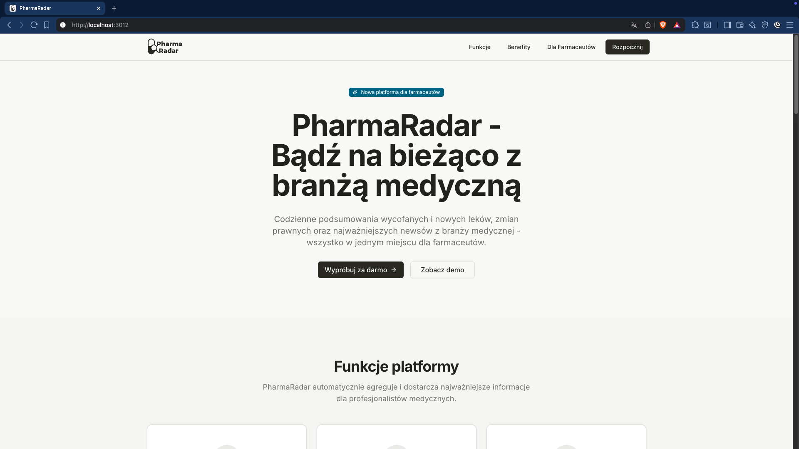
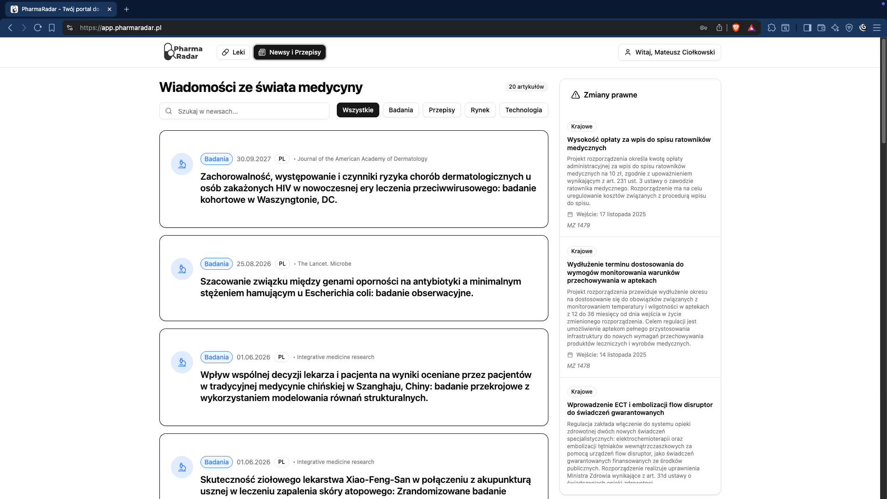
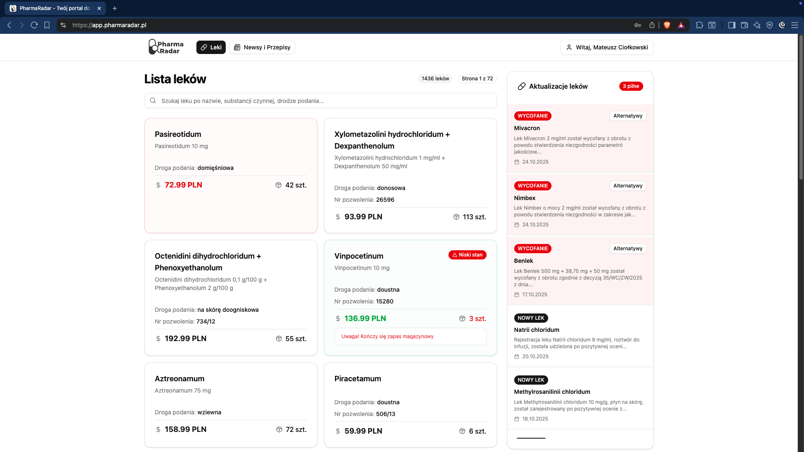
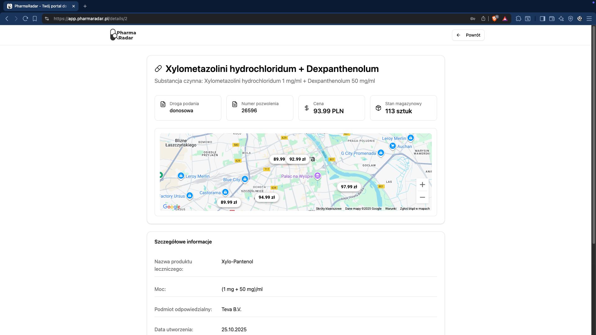

# 🏥 PharmaRadar - SmartTracker

<div align="center">


**Inteligentna platforma dla farmaceutów - bądź na bieżąco z branżą medyczną**

[](https://djangoproject.com/)
[](https://reactjs.org/)
[](https://www.typescriptlang.org/)
[](https://www.postgresql.org/)
[](https://nextjs.org/)

*Rozwiązanie konkursowe dla hackathonu HackAndPlay*

</div>

---

## 🎯 O projekcie

**PharmaRadar** to kompleksowa platforma stworzona specjalnie dla farmaceutów, która automatycznie agreguje i dostarcza najważniejsze informacje z branży medycznej. Aplikacja rozwiązuje problem rozproszenia informacji między różnymi źródłami, zapewniając farmaceutom dostęp do aktualnych danych w jednym miejscu.

### 🚀 Kluczowe funkcje

- 📊 **Monitorowanie wycofanych leków** - automatyczne śledzenie komunikatów GIF
- 💊 **Nowe leki na rynku** - informacje o nowych rejestracjach URPL
- 💰 **Porównywanie cen** - analiza cen leków w aptekach
- ⚖️ **Zmiany prawne** - aktualizacje regulacji prawnych
- 📰 **Newsy branżowe** - agregacja wiadomości medycznych z AI

---
## 📸 Prezentacja aplikacji

Oto jak prezentuje się nasza aplikacja w działaniu:

### Strona główna (Landing Page)
Przejrzysta i intuicyjna strona powitalna, która przedstawia kluczowe funkcje aplikacji Pharma Radar.
 

 
### Sekcja wiadomości (News)
Bądź na bieżąco z najważniejszymi informacjami z branży medycznej, agregowanymi i przetwarzanymi przez AI.


 
### Baza leków (Pills)
Łatwo przeglądaj i wyszukuj informacje o lekach w aptece oraz bądź na bieżąco z nowymi lekami.


 
### Szczegóły leku (Pills-2)
Dostęp do kompleksowych informacji o każdym leku równiez o cenach konkurencji.
 


---


## 🏗️ Architektura systemu

### Backend (Django REST Framework)
```
Backend/
├── api/                    # Główna konfiguracja Django
├── security/              # Autoryzacja i uwierzytelnianie JWT
├── pharmac/               # Baza danych leków
├── scraper/               # Automatyczne pobieranie danych
├── regulations/           # Zarządzanie regulacjami prawnymi
└── news/                  # Agregacja wiadomości medycznych
```

### Frontend (React + TypeScript)
```
Frontend/GitPushers/
├── src/
│   ├── components/        # Komponenty UI
│   ├── pages/            # Strony aplikacji
│   ├── contexts/         # Zarządzanie stanem
│   ├── services/         # Komunikacja z API
│   └── api/              # Konfiguracja API
```

### Landing Page (Next.js)
```
Landing/
├── app/                  # Strona główna Next.js
├── components/           # Komponenty landing page
└── public/              # Zasoby statyczne
```

---

## 🔧 Moduły systemu

### 🛡️ Security Module
- **Autoryzacja JWT** - bezpieczne logowanie i sesje
- **Zarządzanie użytkownikami** - rejestracja i profil
- **Ochrona tras** - kontrola dostępu do funkcji

### 💊 Pharmac Module
- **Baza danych leków** - kompletna informacja o produktach leczniczych
- **Wyszukiwanie** - zaawansowane filtrowanie leków
- **Szczegóły produktu** - pełne informacje o składzie i zastosowaniu

### 🔍 Scraper Module
- **Automatyczne pobieranie** - codzienne aktualizacje z GIF i URPL
- **Przetwarzanie danych** - parsowanie i strukturyzacja informacji
- **AI Enhancement** - generowanie opisów za pomocą sztucznej inteligencji

### ⚖️ Regulations Module
- **Monitorowanie przepisów** - śledzenie zmian prawnych
- **AI Processing** - automatyczne generowanie podsumowań
- **Kategoryzacja** - organizacja regulacji według ważności

### 📰 News Module
- **Agregacja wiadomości** - zbieranie informacji z różnych źródeł
- **Tłumaczenie AI** - automatyczne tłumaczenie na język polski
- **Kategoryzacja** - organizacja newsów według tematów

---

## 📈 Funkcje biznesowe

### Dla farmaceutów:
- ⏰ **Oszczędność czasu** - wszystkie informacje w jednym miejscu
- 📊 **Aktualne dane** - automatyczne aktualizacje
- 🔍 **Zaawansowane wyszukiwanie** - szybkie znajdowanie informacji
- 📱 **Responsywny design** - dostęp z każdego urządzenia

### Dla aptek:
- 💰 **Analiza cen** - porównywanie z konkurencją
- 📊 **Raportowanie** - szczegółowe statystyki
- 🎯 **Targetowanie** - personalizowane informacje

---

## 🛠️ Technologie

### Backend
- **Django 4.2** - framework webowy
- **Django REST Framework** - API
- **PostgreSQL** - baza danych
- **JWT Authentication** - bezpieczeństwo
- **OpenAI API** - sztuczna inteligencja
- **BeautifulSoup** - web scraping

### Frontend
- **React 19** - biblioteka UI
- **TypeScript** - typowanie statyczne
- **Tailwind CSS** - stylowanie
- **React Router** - routing
- **Axios** - komunikacja z API
- **Google Maps API** - mapy

### DevOps
- **Docker** - konteneryzacja
- **Docker Compose** - orkiestracja
- **Nginx** - reverse proxy
- **PostgreSQL** - baza danych produkcyjna

---

## 📊 Dane i źródła

### Oficjalne źródła:
- **GIF** - Główny Inspektorat Farmaceutyczny
- **URPL** - Urząd Rejestracji Produktów Leczniczych
- **Ministerstwo Zdrowia** - regulacje prawne
- **Źródła medyczne** - wiadomości branżowe

### Automatyzacja:
- **Codzienne skanowanie** - automatyczne pobieranie danych
- **AI Processing** - inteligentne przetwarzanie
- **Real-time updates** - natychmiastowe powiadomienia

## 👥 Zespół

**GitPushers Team** - Zespół uczestników hackathonu HackAndPlay
